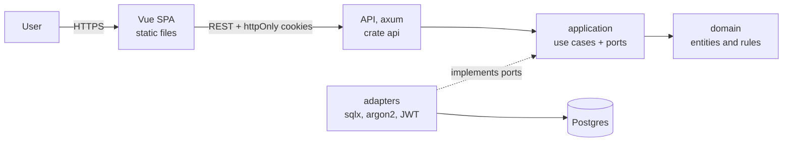

# Containers and layers

```mermaid
flowchart LR
  U[User] -->|HTTPS| W[Vue SPA<br/>static files]
  W -->|REST + httpOnly cookies| A[API, axum<br/>crate api]
  A --> UC[application<br/>use cases + ports]
  UC --> D[domain<br/>entities and rules]
  AD[adapters<br/>sqlx, argon2, JWT] -. implements ports .-> UC
  AD --> DB[(Postgres)]
```

Crate dependencies: `api → application → domain`, and `adapters → application`. `domain` depends
on no workspace crate. `api` wires the adapters in `main`.
